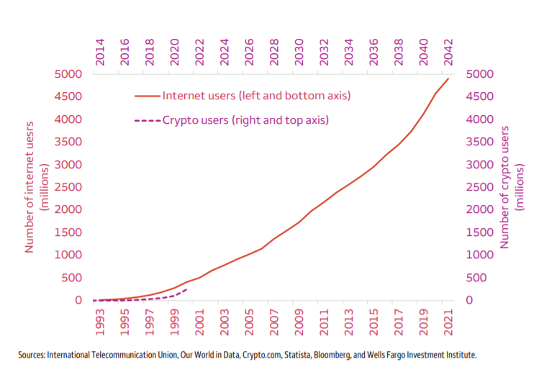

# Competitor Analysis: Layer 1 Blockchain

According to a Chainalysis.com global cryptocurrency adoption report, crypto adoption increased by 880% in 2021! As per the latest reports, less than 5% of the world population transacts in crypto as of December 2021. But that number will grow rapidly considering the potential of scalable Web 3.0 applications. And that’s why you can expect several new blockchain projects to be launched in 2022 and beyond.

**Source**: [https://shardeum.org/blog/top-layer-1-crypto-projects-to-watch-in-2022/](https://shardeum.org/blog/top-layer-1-crypto-projects-to-watch-in-2022/)

### Internet Users vs Crypto users

<figure><figcaption></figcaption></figure>
