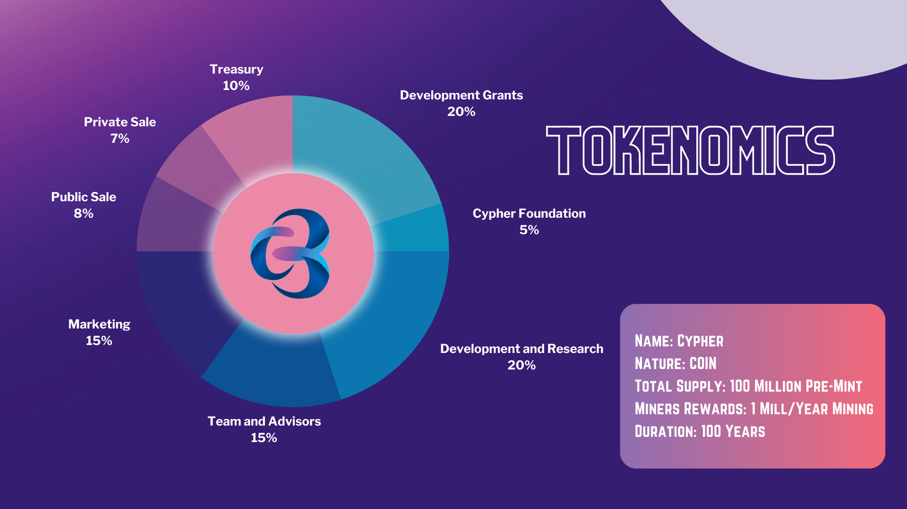

# Tokenomics

$$
Total Token Supply () == 2000000000 (02Billion)
$$

​

|                                                         | Tokens                                    | Cliff (months)                       | Vesting (months)                      |
| ------------------------------------------------------- | ----------------------------------------- | ------------------------------------ | ------------------------------------- |
| <mark style="color:blue;">Private Sale (Round 1)</mark> | <mark style="color:orange;">5.00%</mark>  | <mark style="color:green;">6</mark>  | <mark style="color:purple;">9</mark>  |
| <mark style="color:blue;">Private Sale (Round 2)</mark> | <mark style="color:orange;">6.43%</mark>  | <mark style="color:green;">4</mark>  | <mark style="color:purple;">11</mark> |
| <mark style="color:blue;">Public Sale 1</mark>          | <mark style="color:orange;">0.63%</mark>  | <mark style="color:green;">1</mark>  | <mark style="color:purple;">4</mark>  |
| <mark style="color:blue;">Public Sale 2</mark>          | <mark style="color:orange;">0.50%</mark>  | <mark style="color:green;">0</mark>  | <mark style="color:purple;">4</mark>  |
| <mark style="color:blue;">Co-Founders</mark>            | <mark style="color:orange;">12.00%</mark> | <mark style="color:green;">18</mark> | <mark style="color:purple;">18</mark> |
| <mark style="color:blue;">Advisors</mark>               | <mark style="color:orange;">3.00%</mark>  | <mark style="color:green;">12</mark> | <mark style="color:purple;">24</mark> |
| <mark style="color:blue;">Partners</mark>               | <mark style="color:orange;">1.00%</mark>  | <mark style="color:green;">12</mark> | <mark style="color:purple;">24</mark> |
| <mark style="color:blue;">Tech & Development</mark>     | <mark style="color:orange;">10.00%</mark> | <mark style="color:green;">6</mark>  | <mark style="color:purple;">24</mark> |
| <mark style="color:blue;">Foundation</mark>             | <mark style="color:orange;">5.00%</mark>  | <mark style="color:green;">6</mark>  | <mark style="color:purple;">12</mark> |
| <mark style="color:blue;">Staking/ Block Mining</mark>  | <mark style="color:orange;">20.00%</mark> | <mark style="color:green;">NA</mark> | <mark style="color:purple;">NA</mark> |
| <mark style="color:blue;">Treasury</mark>               | <mark style="color:orange;">5.00%</mark>  | <mark style="color:green;">3</mark>  | <mark style="color:purple;">33</mark> |
| <mark style="color:blue;">Locked Liquidity</mark>       | <mark style="color:orange;">10.00%</mark> | <mark style="color:green;">NA</mark> | <mark style="color:purple;">NA</mark> |
| <mark style="color:blue;">Marketing</mark>              | <mark style="color:orange;">10.00%</mark> | <mark style="color:green;">6</mark>  | <mark style="color:purple;">24</mark> |
| <mark style="color:blue;">Growth</mark>                 | <mark style="color:orange;">10.00%</mark> | <mark style="color:green;">6</mark>  | <mark style="color:purple;">6</mark>  |
| <mark style="color:blue;">Reserve</mark>                | <mark style="color:orange;">1.45%</mark>  | <mark style="color:green;">2</mark>  | <mark style="color:purple;">16</mark> |

